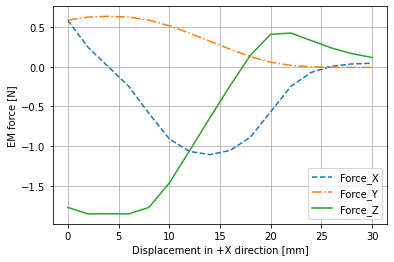

# MagnetForce

This example shows how to calculate magnetic forces between two cuboidal permanent magnet with linear material properties. 

> Analytical_3D_Fxyz.py

The three force components are plotted against the distance, as shown below.

